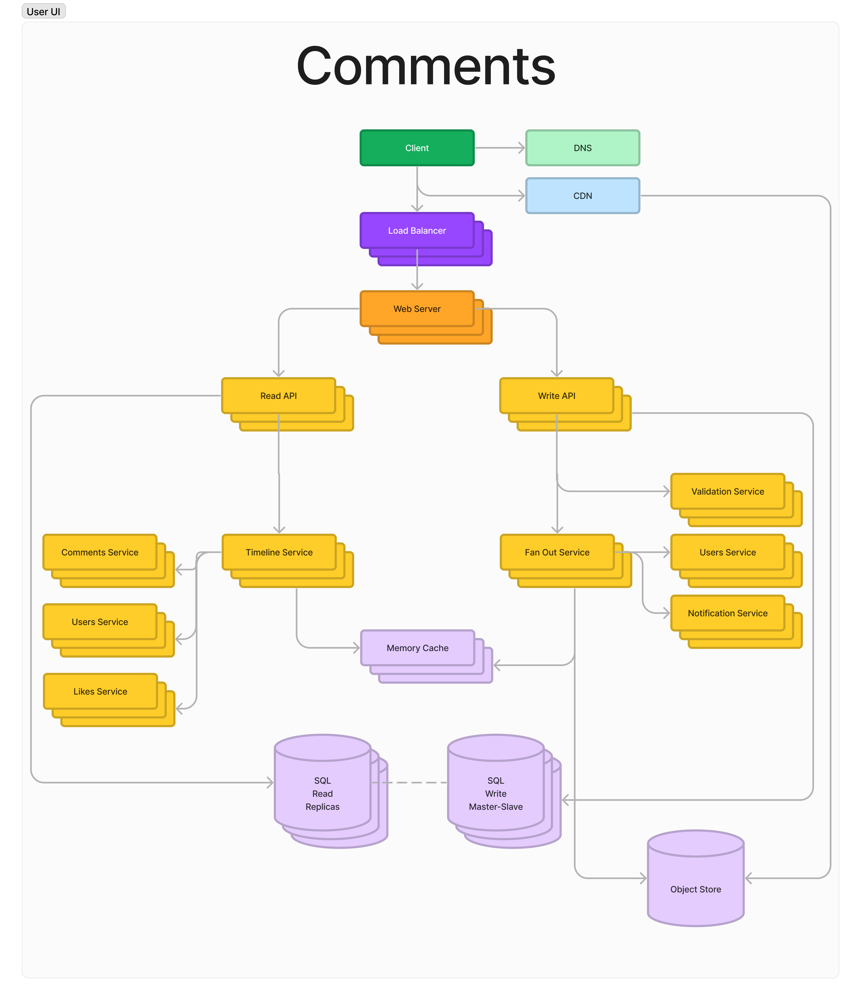
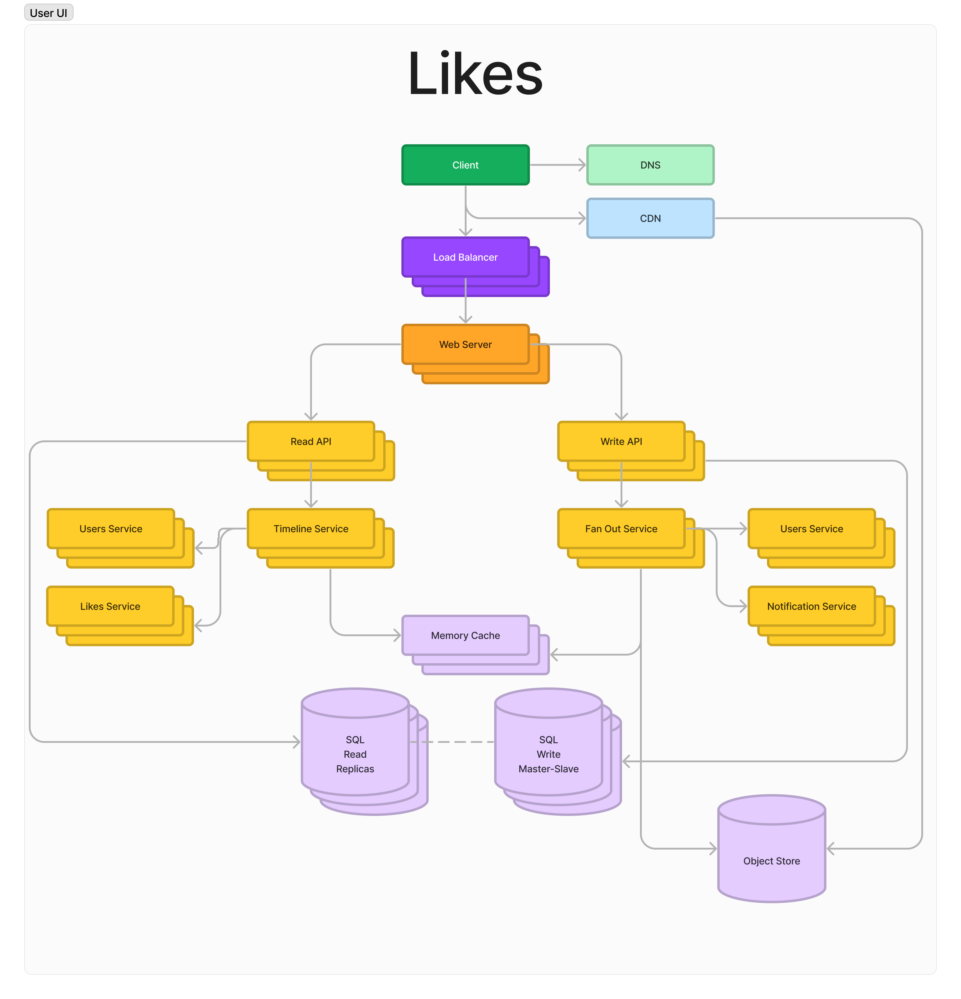

# Software design for instagram comments and likes

## Comments

### Bottlenecks: 

- Probably the `Validation Service` will be the bottleneck here. Performing text validations for inappropriate language, themes, and other content can be a time-consuming task, especially when dealing with various languages. 

### SPOF's

- Probably it's the `Users Service`.

## Likes

### Bottlenecks: 

- Didn't see any serious Bottlenecks out there. But the first service that we will need to scale that is probably `Users Service`.

### SPOF's

- I bet it's the `Users Service`.